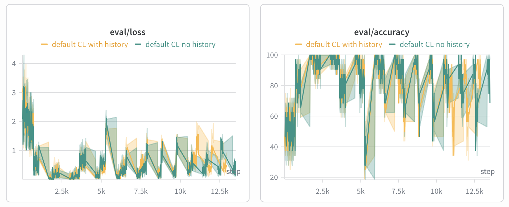
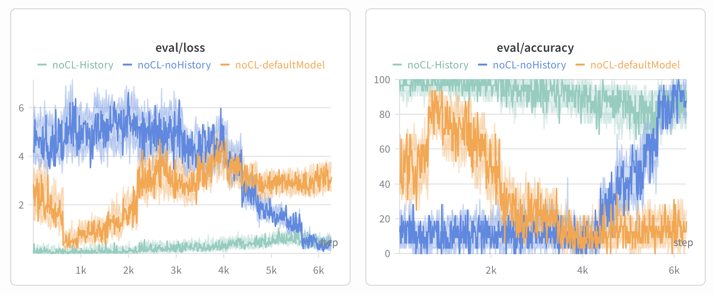

# Tracking Runs

Apeiron ships two experiment-tracking backends, Weights & Biases and MLflow.
Both sit behind the same stage-aware `Logger`, so the choice changes where
metrics land and what the UI looks like — never what is recorded. The metric
namespace documented below is identical either way.

The screenshots on this page are from **Weights & Biases**.

## Enabling a Backend

Set `[logging] backend` to `"wandb"`, `"mlflow"`, or `"none"`. In both tracked
cases `experiment_name` is the grouping key: it becomes the *project* in W&B and
the *experiment* in MLflow.

### Weights & Biases

```toml
[logging]
backend = "wandb"
experiment_name = "mnist-continual-learning"   # W&B project name
```

This is what `examples/mnist/mnist.toml` uses, so the shortest path to a tracked
run is:

```bash
wandb login   # once; or export WANDB_API_KEY=...
poetry run python -m src.main --config examples/mnist/mnist.toml
```

The run prints its URL on startup. To record locally without an account, run
with `WANDB_MODE=offline` and sync later with `wandb sync`.

### MLflow

```toml
[logging]
backend = "mlflow"
experiment_name = "mnist-continual-learning"
# mlflow_tracking_uri = "http://localhost:5000"   # omit for a local ./mlruns store
```

`examples/mnist/mnist-mlflow.toml` ships with this already set:

```bash
poetry run python -m src.main --config examples/mnist/mnist-mlflow.toml
mlflow ui   # in a second terminal → http://localhost:5000
```

With `mlflow_tracking_uri` left commented out, runs are written to a local
`mlruns/` directory. Point it at a server (or a Databricks workspace path, which
is what an `experiment_name` like `/Users/you@org/mnist-continual-learning`
implies) to log remotely.

### Switching Without Editing the Config

```bash
poetry run python -m src.main --config examples/mnist/mnist.toml \
  --set logging.backend=\"mlflow\" \
  --set logging.experiment_name=\"my-experiment\"
```

## What Gets Logged

Metric names are prefixed by pipeline stage, which is what groups them into
panels in W&B and keeps the metric list navigable in MLflow. Alongside the
metrics below, each stage also emits its own step counter (`eval/step`,
`drift/step`, `cl/step`) next to the global one. Every run emits:

**`eval/`** — the monitoring stream.

| Metric | Meaning |
|---|---|
| `eval/accuracy`, `eval/loss` | Per-batch metrics from the harness's `eval_metrics` dict. This is the raw monitoring signal, logged every stream batch. |
| `eval/test_curr_acc` | Accuracy on the *current* regime, logged once after each CL round completes. |
| `eval/test_hist_acc` | Accuracy on the *historical* regime, same cadence. Absent when the harness supplies no historical loaders. |

**`drift/`** — the detector, logged once per `detection_interval`.

| Metric | Meaning |
|---|---|
| `drift/score` | Detector drift score. |
| `drift/detected` | 1 on a drift event. **Zero-values are sampled at 10%** to hold volume down; `detected = 1` is never dropped, so event counts stay exact. |
| `drift/regime`, `drift/confidence` | Detector regime label and confidence, where the detector provides them. |
| `drift/metric_<i>` | The aggregated value actually fed to the detector, where `<i>` is `drift_detection.metric_index`. Note this is the *aggregated* number (mean/median/last over the interval), not the per-batch `eval/` series. |

**`cl/`** — the continual-learning loop, logged per inner iteration.

| Metric | Meaning |
|---|---|
| `cl/drift_event_id` | Which drift event this update belongs to — use it to slice the loss curves per event. |
| `cl/jvp_reg_total_loss`, `cl/jvp_reg_generation_loss`, `cl/jvp_reg_forgetting_loss` | Generation and forgetting loss components, and their sum. Despite the `jvp_reg_` prefix these are logged for **every** update mode, not just `jvp_reg`; for modes with no forgetting term the forgetting component stays at zero. Under `jvp_reg`, which now performs a SAM robust update, the "forgetting" slot carries the accumulated combined current+historical loss rather than a separate retention penalty. |

**`cperf_*`** — cost counters attached to both the `drift/` and `cl/` stages,
covering the `infer`, `detector`, `update_fwd_bwd`, and `optimizer` phases, each
with `_time`, `_flop`, and `_flops` variants. These start only after the
profiler's warmup iterations, so early steps are intentionally absent.

The whole `Config` is recorded as run config/params, so `update_mode`,
`detector_name`, and the detector hyperparameters are all filterable and
groupable in the runs table.

## Reading the Charts

Both figures below are the W&B workspace view on the MNIST example: runs logged
to the same `experiment_name` share a project, so their metrics are overlaid on
one step axis automatically, with the run names as the legend. In each, the pale
band is the raw per-batch series and the solid line is the smoothed one — turn
smoothing down to see the true spread, up to compare trends across runs.

The same comparisons are available in MLflow by selecting the runs in the
experiment table and hitting **Compare**; only the styling differs.

### During the Run: Adaptation on the Live Stream



This is `eval/loss` and `eval/accuracy` on the streaming data for two CL runs —
one training with historical replay, one without.

The **sawtooth is the framework working**. Each cycle is one full drift-and-adapt
episode: a new affine transform lands on the stream, accuracy collapses (some
dips reach 20-40%), the detector fires, the CL loop retrains, and accuracy climbs
back toward 90-100% until the next window shifts again. Roughly a dozen of these
cycles play out over ~13k steps. `eval/loss` shows the same story inverted, with
a spike at each drift and a decay as the update takes hold.

Two things to take from the comparison:

- **The recovered peaks stay near the pre-drift level** across the whole run —
  the model keeps up with a distribution that is getting progressively harder,
  which is exactly the outcome the pipeline exists to produce.
- **The two runs track each other closely.** On the *live stream*, replaying
  history barely changes the picture, because this metric only ever asks how
  well the model handles the regime in front of it right now. What replay buys
  you is invisible here — which is what the next figure is for.

### After the Run: Replaying the Stream to Expose Forgetting



Streaming accuracy alone cannot tell you what a model *lost* while adapting. This
figure answers that: it takes the models produced by the runs above, freezes them
(no CL — hence the `noCL-` run names), and replays the entire stream from the
beginning, so early steps are the earliest, near-clean regimes and later steps
are the most heavily distorted ones.

Read left to right, each curve is a profile of which regimes its model can still
handle:

| Run | Model | Behaviour |
|---|---|---|
| `noCL-History` (green) | CL **with** historical replay | Holds 80-100% across the whole stream. Adapted to the latest regime without giving up the earlier ones. |
| `noCL-noHistory` (blue) | CL **without** historical replay | Near 15% for the first two-thirds, then climbs steeply past ~4k steps to overtake everything else by the end. Competent *only* on the most recent regimes — a textbook picture of catastrophic forgetting. |
| `noCL-defaultModel` (orange) | The initial model, never adapted | The mirror image: peaks around 90% on the early near-clean windows, then decays to 10-20% and stays there. This is the no-CL baseline the other two are beating. |

The green-versus-blue contrast is the argument for replay in one image, and it is
the contrast the live-stream figure cannot show. It is also what
`eval/test_hist_acc` measures continuously during a normal run — see
`mix_historic_data` in [`continuous_learning.md`](continuous_learning.md).

### Cross-Referencing Other Stages

- **`drift/score` on the same step axis** shows whether an accuracy drop was
  actually detected and how long the detector took to call it. In the sawtooth
  figure, every recovery is preceded by a `drift/detected = 1`.
  `drift_detection.detection_interval` sets how coarse that series is relative
  to `eval/`.
- **Slice `cl/` losses by `cl/drift_event_id`** to compare how much work each
  successive adaptation needed — later events generally start from a worse
  position as distortion compounds.
- **Loss and accuracy are worth reading together.** They are not simply mirror
  images: a model can hold accuracy while loss climbs, as confidence erodes
  before predictions actually flip, and that gap often opens just before a
  detector fires.

### Reproducing a Comparison

Run the same config repeatedly under one `experiment_name`, varying a single
field per run. In W&B they land in one project and overlay automatically; in
MLflow, select them in the experiment table and hit **Compare**.

```bash
# with vs. without historical replay, as in the first figure
for mix in true false; do
  poetry run python -m src.main --config examples/mnist/mnist.toml \
    --set continual_learning.mix_historic_data=$mix
done

# or sweep the update strategy
for mode in base ewc_online kfac_online; do
  poetry run python -m src.main --config examples/mnist/mnist.toml \
    --set continual_learning.update_mode=\"$mode\"
done
```

Give each run a distinguishable name so the legend is readable — the figures
above use names like `default CL-with history` and `noCL-defaultModel` rather
than the auto-generated ones.

## Notes and Gotchas

- `[visualization] input` is written **regardless of backend** — every run also
  drops a long-format `step,metric,value` CSV for offline plotting. Runs sharing
  a config overwrite the same CSV, so change that path when you want to keep
  several.
- Setting `backend = "none"` keeps console output and the CSV while skipping the
  tracker entirely. That is what the `examples/mnist/sweep/configs/` files use.
- MNIST's committed `mnist.pth` is deliberately under-trained (~50% on clean
  MNIST), so absolute accuracy in these charts is lower than a converged MNIST
  CNN would show. See the
  [MNIST example README](https://github.com/AI-ModCon/BaseSIM_APEIRON/blob/main/examples/mnist/README.md).
