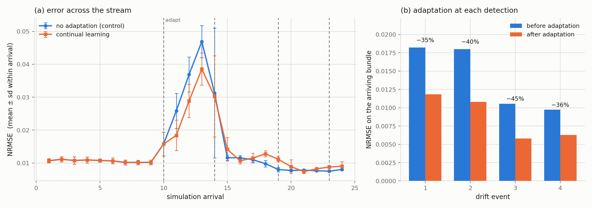

# MATEY Example

A MATEY vision-transformer surrogate for SOLPS plasma-edge simulations, run
through the same monitor → detect → adapt → resume loop as the other examples.

This is the only bundled example where **the drift is real**. MNIST, CIFAR and
ImageNet manufacture drift by drawing affine transforms; here the stream is a
sequence of physics simulations that genuinely arrive from different scenarios
and different tokamaks, and the surrogate's error moves because the physics
moved. It is also the only example whose model comes from an external package,
and the only one where the monitored quantity is a regression error (NRMSE)
rather than classification accuracy.

Like `imagenet/`, it cannot fetch its own inputs: **you supply the MATEY package,
a checkpoint, and the SOLPS data.**

## Contents

| File | Purpose |
|---|---|
| `model.py` | `MATEYHarness` — builds the MATEY model from a checkpoint, adapts its loaders and batch types to `BaseModelHarness`, defines the NRMSE metrics |
| `model_stream.py` | `MATEYStreamHarness` — walks an ordered sequence of arriving simulations instead of one static root |
| `src/settings.py` | `MateySettings` — the MATEY-side knobs, read from the data root (see below) |
| `src/matey_batches.py` | Adapters between MATEY's dataclass batches and the framework's `(x, y)` contract |
| `src/solps_split.py` | Deterministic, cached train/valid staging of a SOLPS root |
| `src/solps2dwion_dataset.py` | `SOLPS2DwIONDataset` — a `b2time.nc` reader registered into MATEY's dataset registry |
| `src/solps_field_maps.py` | SOLPS field names and map squeezing |
| `src/fusionbench_eval_hooks.py` | `patch_leadtime`, so evaluation matches the checkpoint's rollout horizon |
| `matey.toml` | Single-root config — ADWIN, `base` updater |
| `matey_stream.toml` | Sequential-arrival config — KSWIN; this is the one that produces the drift result below |
| `Demo_SOLPS_vit.yaml` | Fallback MATEY architecture params, used when the checkpoint ships no `hyperparams.yaml` |

## Prerequisite 1: The MATEY Package

`model.py` imports `matey` lazily, inside the functions that need it, so the
module imports and its unit tests collect without it. Running the example does
require it:

```bash
pip install "git+ssh://git@github.com/FusionFM/MATEY.git@<commit>"
```

The pinned commit is `MATEY_GIT_COMMIT` in `model.py`. **That repository is
currently private**, so reviewers without access can read the harness and run its
tests, but cannot execute the example end to end.

## Prerequisite 2: The Data

### Single root (`matey.toml`)

A SOLPS root with `train/` and `valid/` subdirectories. `data.path` points at the
parent; the harness stages a deterministic split beneath it and caches it.

### Stream root (`matey_stream.toml`)

`MATEYStreamHarness` walks simulations in arrival order, so its root holds one
bundle directory per arrival plus two small JSON files:

```
<data.path>/
  stream_manifest.json
  matey_settings.json
  seg_000_<case>_00/   train/ valid/
  seg_001_<case>_01/   train/ valid/
  ...
```

`stream_manifest.json` gives the order and each arrival's metadata:

```json
{
  "n_arrivals": 32,
  "machine_change_points": [16, 24],
  "arrivals": [
    {"index": 0, "dir": "seg_000_baseline_00", "case": "baseline",
     "machine": "D3D", "segment": 0, "time_range": [0, 60],
     "train_range": [0, 36], "valid_range": [41, 56]}
  ]
}
```

`matey_settings.json` carries the settings that describe the data and the
checkpoint rather than the continual-learning run:

```json
{
  "dset_type": "SOLPS2DwION",
  "field_labels": [533, 534, 535],
  "leadtime": 1,
  "use_step_inference": true
}
```

These deliberately live here rather than in the TOML. `apeiron.config` is shared
with every other user of the framework, and a key like `field_labels` means
nothing to the MNIST example; `src/settings.py` has the full rationale and the
defaults. Every field is optional.

**Read about `field_labels` before trusting any number.** MATEY assigns each
dataset a slice of a global field-embedding table by walking its registry in
insertion order, so registering a dataset class at runtime appends it, and the
slice depends on the *local* registry rather than the one used during
pre-training. Getting it wrong is silent — the table is wide enough that the
indices stay in bounds — and it inflated SOLPS NRMSE from ~0.11 to ~0.63 before it
was found. Re-derive it whenever the checkpoint changes.

## Running It

From the **repository root**:

```bash
poetry run python -m src.main --config examples/matey/matey_stream.toml \
  --set data.path=/path/to/solps_stream \
  --set model.pretrained_path=/path/to/best_ckpt.tar
```

`drift_detection.max_stream_updates` must be `n_arrivals - 1`: `ContinuousMonitor`
calls `update_data_stream()` once before its loop and once per extension, so
`n_arrivals` requests one past the end. The harness raises with the correct value
if you get it wrong.

To check the wiring without a staged stream, run the single-root config over a
handful of shots and one window:

```bash
poetry run python -m src.main --config examples/matey/matey.toml \
  --set data.path=/path/to/solps \
  --set drift_detection.max_stream_updates=1 --set train.max_iter=5
```

An empty `model.pretrained_path` is **not** benign here. Unlike ImageNet there is
no stock pretrained MATEY, so the ViT starts from random weights and every error
number is meaningless; the stream harness warns when this happens.

## Result



Two arms over the identical stream: `update_mode = "base"` against
`update_mode = "none"` as the control. Panel (a) is per-arrival mean +/- sd of the
monitored NRMSE; the dashed lines are the arrivals after which drift fired and
adaptation ran. Panel (b) is the before/after error on each arriving bundle.

Adaptation cuts error 35-45% on the bundle that triggered it, and the two arms
separate clearly through the held-out excursion. They also cross back after
arrival ~17: adapting to the held-out scenario costs accuracy on the later
cross-machine block, which is negative transfer rather than noise -- the
historical-domain metric rises over the same span and does not recover.
Reproduce with:

```bash
python examples/matey/plot_stream_arms.py "$OUTDIR" --events-at 10 14 19 23
```

## How the Drift Arises

Nothing is synthesised. The 24-arrival stream the shipped config describes is
ordered so the change points are unambiguous: sixteen arrivals from one tokamak
(a scenario the surrogate saw in pre-training, then a held-out scenario on the
same machine), then eight from a second machine. The machine change falls at
arrival 16.

Only the held-out scenario is genuinely unseen — the checkpoint trains on the
whole SOLPS tree, so the cross-machine arrivals are "different machine,
under-fit" rather than "never seen". That distinction matters when reading the
results.

`get_hist_dataloaders()` returns the most recent arrival of the stream's *first*
case, which is what makes forgetting measurable: after adaptation,
`history_eval()` scores the model back on the data it started out good at.

## Expected Outcome

The console loop has the same shape as the other examples. What differs is the
detector and the metric: KSWIN on `nrmse_mean` (`metric_index = 3`), because the
shift shows up as a change in the error *distribution* that mean-based detectors
miss. ADWIN and Page-Hinkley at their shipped settings never fire on this signal
at all.

The 60/20 KSWIN window was chosen by replaying a recorded control stream through
candidate configurations: it fires on the held-out excursion with zero false
alarms before onset and none at either machine change. `kswin_seed` is set,
because KSWIN samples its reference window at random and the run is otherwise not
reproducible.

Continual learning helps at every event it fires on, measured on the arrival it
has just adapted to:

| CL event | NRMSE before | after | change |
|---|---|---|---|
| 1 | 0.01824 | 0.01169 | −35.9% |
| 2 | 0.01811 | 0.01078 | −40.5% |
| 3 | 0.01018 | 0.00569 | −44.1% |
| 4 | 0.00996 | 0.00626 | −37.2% |
| 5 | 0.00703 | 0.00561 | −20.2% |

Aggregated over the whole stream against a no-adaptation control the picture is
more mixed, and worth stating plainly: adaptation is a clear win on the held-out
scenario (−12.3% NRMSE), roughly neutral on the in-distribution baseline, and a
**loss** on one cross-machine block (+12.9%). Two things drive that. The detector
fires some windows after the regime actually changed, so part of the adaptation
lands on the wrong side of the boundary; and the gains are local to the window
that was adapted on. Over the whole stream, continual learning comes out about 4%
ahead of no adaptation.

These are numbers from one checkpoint on one staged stream. Treat them as a
worked example of the analysis, not as a benchmark.

### Artifacts

- The CSV at `[visualization] input` — `eval/*`, `drift/*` and `cl/*` rows, plus
  `val_pre_*` / `val_post_*` for every metric on the current and historical
  domains around each CL round.
- The end-of-run summary reports drift checks, detections and CL dispatches, so a
  run where nothing fired is distinguishable from a broken detector.

### Cost

Every window runs MATEY forward passes over a SOLPS validation split, and each
drift event fine-tunes on the arriving bundle. `eval.max_val_batches` caps the
per-window evaluation, since a full split costs far more than the drift decision
it feeds. Expect a multi-GPU allocation for the full 24-arrival stream; the
single-root smoke test above runs in minutes.
