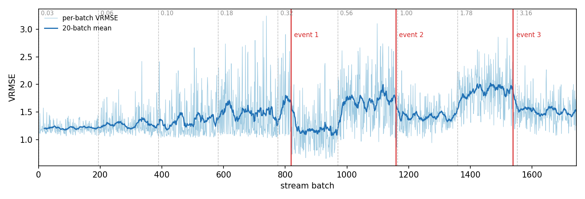

# The Well — continual learning under real physical regime change

[The Well](https://polymathic-ai.org/the_well/) is a collection of physics
simulation datasets from PolymathicAI. Each dataset is a parameter sweep: one
HDF5 file per value of a physical parameter. Streamed in parameter order, a
sweep is data whose distribution shifts for a physical reason — the situation
APEIRON monitors for. This example streams a sweep one regime per window,
detects each regime change in the model's error, and adapts the model with
continual learning when one is found.

The dataset is `turbulent_radiative_layer_2D`, the smallest in the collection:
nine regimes of 2D turbulence swept over cooling time `tcool` from 0.03 to
3.16.

| Setting | Value |
|---|---|
| `data.name` | `well:turbulent_radiative_layer_2D` |
| Model `unet_small` | The Well's `UNetClassic` at `init_features=16`, 1.94M parameters; the shipped config, runs without a GPU |
| Model `unet` | the same architecture at `init_features=48`, 17.5M parameters; the width of The Well's published checkpoint, wants a GPU |
| Detector | Page-Hinkley on per-batch VRMSE |
| Continual learning | `ewc_online`, replaying all earlier regimes |
| Data | downloaded one regime at a time into `./data/well`, ~0.68 GB per regime |

## Running it

```bash
poetry run python -m src.main --config examples/well/well_trl2d.toml
```

Nothing to download by hand. Each window fetches its regime, converts it once
into a memory-mappable array, and drops the HDF5. A shorter run costs
proportionally less:

```bash
# three regimes instead of nine
poetry run python -m src.main --config examples/well/well_trl2d.toml \
    --set drift_detection.max_stream_updates=2
```

If you already have The Well on disk, point at it. Nothing is downloaded or
deleted:

```bash
poetry run python -m src.main --config examples/well/well_trl2d.toml \
    --set data.path=/scratch/the_well/datasets
```

## Training overview

The run streams nine windows, one regime per window in `tcool` order, 194
batches each. The detector scores every batch's VRMSE before any training
touches it (test-then-train), so it never reads data the model has already
fitted. When it fires, the run makes `train.max_iter` gradient steps on the
current regime mixed half-and-half with replay of all earlier regimes, writes
a checkpoint, resets the detector, and resumes streaming:

```
Window 4: regime turbulent_radiative_layer_tcool_0.32
==== DRIFT DETECTED (Event #1)! ====
-> Dispatching continual learning module...
CL Updates (drift_event_id=1): 100%|██████████| 200/200
<- Continual learning complete.
==== RESUMING MONITORING! ====
Window 5: regime turbulent_radiative_layer_tcool_0.56
```

Splits: the stream and the training rounds read `train`, evaluation during the
run reads `valid`, and `test` is never touched by a run. Checkpoints are
scored against `test` afterwards:

```bash
poetry run python -m examples.well.evaluate \
    --config examples/well/well_trl2d.toml --baselines --random
```

### The data pipeline

The Well publishes each regime as HDF5 under `data/train/`, `data/valid/` and
`data/test/`. Before a regime becomes a window it is fetched (landed through a
`.part` rename, so a file that exists is complete) and converted once to
`.npy`, shaped `[trajectory, time, channel, *spatial]`, float32. HDF5 is
chunked and often compressed, so the operating system cannot map it; `.npy` it
can, and a sample then faults in only the pages it touches. A downloaded HDF5
is deleted after conversion: nothing reads it again and it can be fetched
back. The conversion carries a recipe string; changing the conversion bumps
`CONVERSION_RECIPE` and existing arrays are rebuilt.

Normalisation comes from The Well's `stats.yaml` and is fixed across regimes.
Normalising per regime would divide out the shift being detected.

### The model

[`unet.py`](unet.py) is The Well's `UNetClassic` (BSD-3, adapted from
PDEBench), copied in rather than imported: importing it from `the_well` pins
`neuraloperator==0.3.0` through their package `__init__`, and the copy needs
torch only. Layer names and shapes are unchanged, so The Well's published
checkpoints load with `strict=True`. `[model] name` selects the width:
`unet_small` is `init_features=16` and `unet` is the published
`init_features=48`. Set `name = "unet"` and `pretrained_path` to a downloaded
`model.safetensors` to start from the published weights.

One change in the harness: BatchNorm running statistics are held still during
training. Each window is a different regime, so live batch statistics track
the current regime underneath the adaptation being measured — twenty forward
passes in `train()` mode with no optimizer move the published checkpoint from
0.204 to 1.569 VRMSE on its own regime. Freezing adds no parameters and
renames nothing, so checkpoints still load. Without it this run's score rises
after the second event, 1.146 to 1.481.

## Validating drift detection across regimes

**Purpose.** The dataset only exercises drift detection if regime boundaries
leave a detectable mark in the model's error. That is checked before anything
is claimed about adaptation.

**Method.** One monitoring pass — 1,744 batches over all nine regimes with
learning switched off — is replayed through candidate detectors offline. Each
candidate is scored on boundaries found and on how often the same settings
fire on shuffled copies of the same values, where no boundaries remain.
Separately, `cl_only.py` runs the same continual learning on fixed, periodic
and random schedules with no detector, to compare the detector's placement of
training rounds against schedules chosen by hand.

**Result.** The shipped Page-Hinkley settings fire four times on the real
stream against 1.75 on shuffled, a ratio of 2.3, and the four fires land at
regime boundaries. Settings that fire nine times land near all eight
boundaries but fire ten times on shuffled data. The fifth boundary (`tcool`
1.78 to 3.16, a +0.5 sigma step directly after a +1.75 sigma one) is not
reachable with a single absolute threshold; a log transform, the `ph_alpha`
forgetting factor, and an ensemble over Page-Hinkley, ADWIN and KSWIN all cap
at four. ADWIN alone never fires at any delta from 0.002 through 0.9: the
per-batch scatter within a regime exceeds the step between neighbouring
regimes, so adaptive windowing finds no split. See
[`docs/choosing_a_detector.md`](../../docs/choosing_a_detector.md).

The trace the detector watched, from the shipped run — per-batch VRMSE, its
20-batch mean (the detector sees one mean per detection interval), regime
boundaries labelled by `tcool`, and the three firings. Each firing is followed
by a drop: the adaptation it triggered lowers the error on the regime that
fired it.



To regenerate from a run's metrics CSV:

```bash
poetry run python -m examples.well.plot     --config examples/well/well_trl2d.toml --metrics output/well_trl2d.csv
```

The schedule comparison. Every arm is `unet_small` trained for three 200-step
rounds; each row is that arm's final checkpoint. Columns are `tcool` regimes;
cells are VRMSE on the test split, lower is better:

| Schedule | Trained in windows | 0.03 | 0.06 | 0.10 | 0.18 | 0.32 | 0.56 | 1.00 | 1.78 | 3.16 | Mean |
|---|---|---|---|---|---|---|---|---|---|---|---|
| detector | 4, 5, 7 | 0.692 | 0.679 | 0.655 | 0.661 | 0.737 | 0.740 | 0.844 | 1.076 | 1.617 | **0.856** |
| fixed, at the detector's windows | 4, 5, 7 | 0.692 | 0.679 | 0.655 | 0.661 | 0.737 | 0.740 | 0.844 | 1.076 | 1.617 | **0.856** |
| every third window | 2, 5, 8 | 0.703 | 0.687 | 0.669 | 0.682 | 0.768 | 0.770 | 0.868 | 1.092 | 1.603 | **0.871** |
| random, seed 0 | 4, 5, 7 | 0.692 | 0.679 | 0.655 | 0.661 | 0.737 | 0.740 | 0.844 | 1.076 | 1.617 | **0.856** |
| random, seed 1 | 3, 4, 6 | 0.676 | 0.666 | 0.653 | 0.656 | 0.764 | 0.805 | 0.987 | 1.286 | 1.968 | **0.940** |

Three rows are identical because three schedules trained in the same windows:
random seed 0 drew exactly the windows the detector chose, and the fixed arm
replayed them. Identical windows and seed producing an identical model also
confirms the detector path and `cl_only.py` differ in nothing else. Random
seed 1 trained early and scores worst on the hottest regimes. No schedule
beats the detector's placement, and the detector was not told where the
boundaries were.

## Computational performance

**Purpose.** Measure what detect-and-adapt costs against training on all the
data at once. The Well's published checkpoint — `unet`,
trained 500 epochs on all nine regimes jointly — sets the loss target and the cost of the naive approach. Persistence (repeat the last
input frame) and a zero prediction bound the loss from below and above at no
training cost.

**Method.** `evaluate.py` scores each checkpoint and reference model on the
test split. Costs are measured with PyTorch's FLOP counter at this dataset's
resolution: a `unet_small` forward pass is 4.7 GFLOP per sample, `unet` is
41.2, and a training step is about three forward passes. A run's envelope
counts the stream (one forward per sample) plus its training steps; mid-run
evaluation is excluded on both sides. The published envelope is 500 epochs
over all nine regimes at `unet` width: 432 PFLOP.

To score the published checkpoint here:

```bash
curl -LO https://huggingface.co/polymathic-ai/UNetClassic-turbulent_radiative_layer_2D/resolve/main/model.safetensors

poetry run python -m examples.well.evaluate \
    --config examples/well/well_trl2d.toml --baselines --random \
    --reference model.safetensors --reference-name published
```

`evaluate.py` builds each model at the width recorded in its own weights, so
a `unet` reference scores beside `unet_small` checkpoints.

**Result.** One table, every model scored on the same nine test regimes.
Columns are `tcool` regimes; cells are VRMSE on the test split, lower is
better. FLOPs count a run's stream plus its training steps; the three
`unet_small` runs differ only in `train.max_iter`
(`--set train.max_iter=800`):

| Model | Training | Steps per event | Drift fired (window) | FLOPs | 0.03 | 0.06 | 0.10 | 0.18 | 0.32 | 0.56 | 1.00 | 1.78 | 3.16 | Mean |
|---|---|---|---|---|---|---|---|---|---|---|---|---|---|---|
| `unet` | published, all regimes jointly | all (one event) | — | 432 PF | 0.298 | 0.308 | 0.284 | 0.248 | 0.223 | 0.209 | 0.183 | 0.200 | 0.212 | **0.240** |
| persistence | none; repeats the last input frame | — | — | 0 | 0.620 | 0.644 | 0.593 | 0.608 | 0.576 | 0.555 | 0.530 | 0.523 | 0.536 | **0.576** |
| zero | none; predicts a zero field | — | — | 0 | 1.200 | 1.180 | 1.301 | 1.205 | 1.588 | 1.826 | 2.640 | 3.506 | 5.861 | **2.256** |
| `unet_small` | none; the untrained starting model | — | — | 0 | 1.186 | 1.163 | 1.354 | 1.293 | 1.865 | 2.296 | 3.288 | 4.383 | 7.025 | **2.650** |
| `unet_small` | detect and adapt | 200 | 4, 5, 7 | 0.067 PF | 0.692 | 0.679 | 0.655 | 0.661 | 0.737 | 0.740 | 0.844 | 1.076 | 1.617 | **0.856** |
| `unet_small` | detect and adapt | 800 | 4, 6 | 0.124 PF | 0.607 | 0.607 | 0.570 | 0.583 | 0.613 | 0.628 | 0.694 | 0.849 | 1.168 | **0.702** |
| `unet_small` | detect and adapt | 1600 | 4, 7 | 0.215 PF | 0.580 | 0.582 | 0.546 | 0.562 | 0.571 | 0.571 | 0.599 | 0.706 | 0.896 | **0.624** |

The `unet` row checks the pipeline: The Well's weights scored through this
example's conversion, normalisation and metric give 0.2405, between the two
figures they publish (0.2394 on the model card, 0.2418 on the dataset page).

The 200-step run's intermediate checkpoints, scored the same way, improve on
every regime at every event: mean 2.650 untrained, 1.853 after the first
event, 1.055 after the second, 0.856 after the third. Starting from an
untrained model, anything learned anywhere helps everywhere, so no forgetting
is visible at this budget.

The high-`tcool` regimes are not intrinsically harder: persistence and `unet`
both improve slightly as `tcool` rises. What climbs is the error of a model
that has not seen those regimes, 1.19 to 7.02 across the untrained row, and
that climb is what the detector reads.

Two effects as the per-event budget rises. The loss crosses persistence: on no
regime at 200 steps, on four at 800, on five at 1600 (`tcool` 0.03 through
0.32). And the detector fires less — three events at 200 steps, two at 800
and 1600 — because each adaptation flattens the error climb the detector
reads. Event counts are therefore not comparable across runs; FLOPs are.

The 1600-step run reaches 0.624 at 1/2000th of the published compute. The
remaining gap to 0.240 is partly training budget and partly `unet_small`
capacity. The same experiment with `unet` on a GPU is a config change;
[`perlmutter.sbatch`](perlmutter.sbatch) runs it on NERSC Perlmutter and
scores the result.

## Adding another Well dataset

Every dataset-specific detail lives in one row in [`datasets.py`](datasets.py):

```python
RAYLEIGH_BENARD = WellDataset(
    name="rayleigh_benard",
    fields=(
        ("t0_fields", "buoyancy", None),
        ("t0_fields", "pressure", None),
        ("t1_fields", "velocity", 0),
        ("t1_fields", "velocity", 1),
    ),
    spatial_resolution=(512, 128),
    n_spatial_dims=2,
    order=lambda name: float(name.split("_Rayleigh_")[1].split("_")[0]),
)
```

Three fields to get right:

- `fields` — which HDF5 groups and fields become which channels. The Well
  stores scalars under `t0_fields` and vectors under `t1_fields`; a vector
  needs a component index. Channel count, and the model's input width, follow
  from this.
- `spatial_resolution` and `n_spatial_dims` — the grid. Conversion checks it
  against the file, so a wrong row fails with the shape it found. The U-Net
  pools four times, so each axis must divide by 16.
- `order` — how to read the swept parameter out of a filename, for sorting.
  The default takes the trailing number, which is only correct for a
  single-parameter sweep:

  ```
  turbulent_radiative_layer_tcool_0.06      -> 0.06   correct
  rayleigh_benard_Rayleigh_1e10_Prandtl_1   -> 1.0    sorts by Prandtl
  shear_flow_Reynolds_1e4_Schmidt_1e-1      -> 0.1    sorts by Schmidt
  viscoelastic_instability_AH               -> inf    no number at all
  ```

  A two-parameter sweep needs its own key function. A dataset whose files are
  named flow states (`viscoelastic_instability` is `AH`/`CAR`/`EIT`) needs an
  explicit sequence — chosen rather than derived, so several normal regimes
  can be placed ahead of an anomalous one.

`order` also sets the difficulty of detection: monotonic cooling time, which
ships, gives the detector four of eight boundaries; interleaving cool and hot
regimes makes each boundary a larger step and gives six of eight.

Nothing else in the example is dataset-specific. The harness reads the row.

## Files

| File | What it is |
|---|---|
| `datasets.py` | The registry, the fetch, and the HDF5 to `.npy` conversion |
| `model.py` | The harness: one regime per window, VRMSE, replay of earlier regimes |
| `unet.py` | The Well's U-Net baseline, vendored (BSD-3) |
| `evaluate.py` | Scores a run's checkpoints against the test split |
| `plot.py` | Plots a run's stream VRMSE, regime boundaries, and drift events |
| `perlmutter.sbatch` | Runs the `unet` experiment on NERSC Perlmutter and scores it |
| `well_trl2d.toml` | The config |

## Citation

```bibtex
@inproceedings{ohana2024thewell,
  title={The Well: a Large-Scale Collection of Diverse Physics Simulations
         for Machine Learning},
  author={Ohana, Ruben and McCabe, Michael and Meyer, Lucas and others},
  booktitle={Advances in Neural Information Processing Systems},
  year={2024}
}
```
